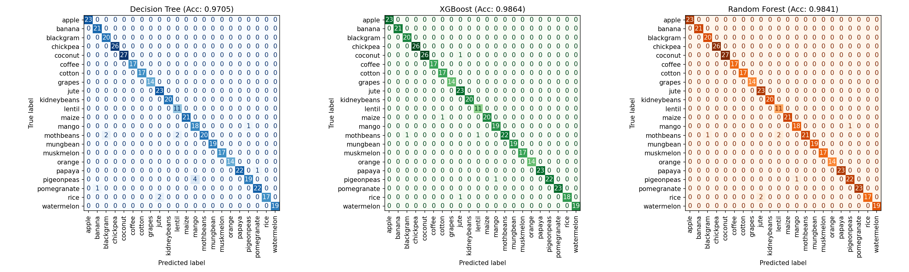

# 🌾 Crop Recommendation System

A machine learning project that recommends the most suitable crop to grow based on soil nutrients (Nitrogen, Phosphorus, Potassium) and environmental factors (temperature, humidity, pH, rainfall). Includes a trained model comparison and an interactive **Streamlit** web app for real-time predictions.

---

## 📊 Dataset

- **Source:** [Crop Recommendation Dataset (Kaggle)](https://www.kaggle.com/datasets/atharvaingle/crop-recommendation-dataset)
- **Size:** 2200 rows × 8 columns
- **Crops:** 22 different crops (rice, maize, chickpea, banana, mango, coffee, cotton, jute, and more), 100 samples each
- **Features:**
  | Column | Description |
  |---|---|
  | Nitrogen | Nitrogen content in soil |
  | Phosphorus | Phosphorus content in soil |
  | Potassium | Potassium content in soil |
  | Temperature | Temperature in °C |
  | Humidity | Relative humidity in % |
  | pH_Value | Soil pH value |
  | Rainfall | Rainfall in mm |
  | Crop | Target label (crop name) |

---

## 🔍 Project Workflow

1. **Data Loading & EDA** — Explored unique crops and class distribution (perfectly balanced: 100 samples/crop)
2. **Feature Correlation** — Heatmap analysis revealed high correlation between Phosphorus and Potassium (0.74) → dropped Phosphorus to reduce redundancy
3. **Feature Scaling** — Standardized features using `StandardScaler`
4. **Model Training & Tuning** — Trained and tuned 3 classifiers with `GridSearchCV` (5-fold cross-validation):
   - Decision Tree Classifier
   - XGBoost Classifier
   - Random Forest Classifier
5. **Model Evaluation** — Compared accuracy and analyzed confusion matrices for all three models
6. **Model Selection** — Best performing model saved for deployment
7. **Deployment** — Interactive Streamlit app for live predictions

---

## 🏆 Model Performance

| Model | Accuracy |
|---|---|
| Decision Tree | 97.05% |
| Random Forest | 98.41% |
| **XGBoost** ⭐ (best model) | **98.64%** |

XGBoost was automatically selected as the best-performing model and is the one deployed in the Streamlit app.

---

## 🧩 Confusion Matrices



Confusion matrices for all three models, evaluated on the held-out test set. Strong diagonal values across every crop class confirm high prediction accuracy, with only minor confusion between visually/nutritionally similar crops (e.g. cotton/coffee, mothbeans/pigeonpeas).

---

## 🗂️ Project Structure

```
crop-recommendation-system/
│
├── crop_recommendation_model.py   # Full ML pipeline: EDA, preprocessing, training, tuning, confusion matrix
├── streamlit_app.py               # Streamlit web interface for predictions
├── Crop_recommendation.csv        # Dataset
├── best_crop_model.pkl            # Saved best model (generated after running the pipeline)
├── scaler.pkl                     # Saved StandardScaler
├── feature_columns.pkl            # Feature column order used during training
├── label_encoder.pkl              # Label encoder (used if XGBoost is the best model)
├── best_model_name.pkl            # Name of the selected best model
├── confusion_matrices.png         # Confusion matrix comparison for all 3 models
└── README.md
```

---

## ⚙️ How to Run

### 1. Clone the repository
```bash
git clone https://github.com/<raman9728152450>/crop-recommendation-system.git
cd crop-recommendation-system
```

### 2. Install dependencies
```bash
pip install pandas numpy scikit-learn xgboost seaborn matplotlib joblib streamlit
```

### 3. Train the model
Run `crop_recommendation_model.py` (in Jupyter, Colab, or as a script) to:
- Train and tune all three models
- Generate the confusion matrix comparison (`confusion_matrices.png`)
- Generate the `.pkl` files needed for the app

### 4. Launch the web app
```bash
streamlit run streamlit_app.py
```
Open the local URL shown in the terminal (usually `http://localhost:8501`) to use the interface.

---

## 🖥️ Streamlit App Features

- Simple input form for soil and weather parameters
- Instant crop recommendation on button click
- Automatically loads the best-performing trained model

---

## 🛠️ Tech Stack

- **Language:** Python
- **Libraries:** pandas, scikit-learn, XGBoost, seaborn, matplotlib, joblib
- **Web Framework:** Streamlit
- **Environment:** Google Colab / Jupyter Notebook

---

## 📌 Future Improvements

- Add more ML models (SVM, KNN) for comparison
- Deploy the Streamlit app on Streamlit Cloud / Render
- Add soil image-based crop prediction
- Multi-language support for the interface

---
